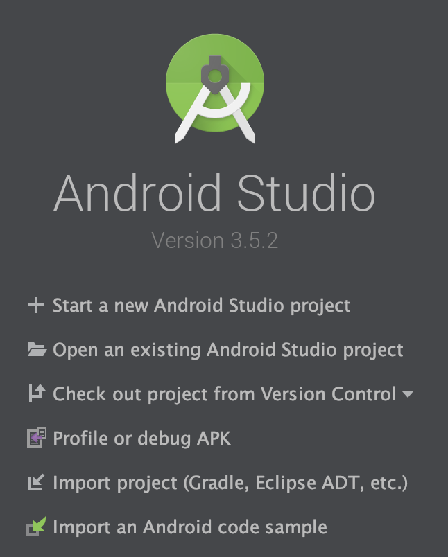
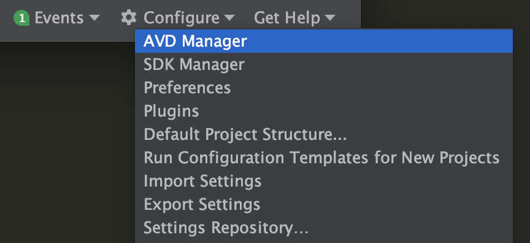
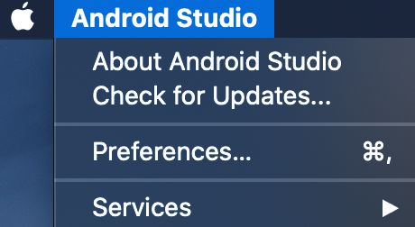
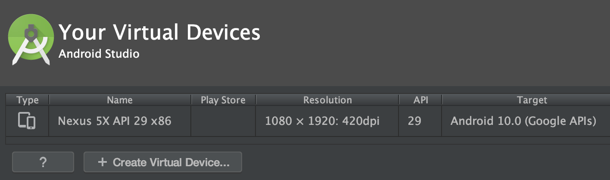

# Android

[Ionic Android installation docs](https://ionicframework.com/docs/installation/android)

Ensure you have Java 8 installed

If you don't have Java installed, install it via brew or a similar package manager for your OS.

## Install Java 8

Recipe from Nov 2019

```sh
brew tap adoptopenjdk/openjdk
brew cask install adoptopenjdk8
```

Alternatively `brew cask install adoptopenjdk/openjdk/adoptopenjdk8`

### Check that Java was installed

```sh
$ java -version
openjdk version "1.8.0_232"
OpenJDK Runtime Environment (AdoptOpenJDK)(build 1.8.0_232-b09)
```

## Install Gradle

See [Gradle install docs](https://gradle.org/install/)

```sh
brew install gradle
```

## Install Android Studio

Install from [Android developer studio](https://developer.android.com/studio/)

Launch Android Studio



Click the `configure` menu and select `SDK manager`



Make sure that an SDK for the latest Android is installed


On a Mac, the SDK should be installed/located in `$HOME/Library/Android/sdk`

## Update Android Studio

In the Android top level menu, select `Check for updates`



On the SDK updates screen select `Update now` to install the updates. Otherwise select `Remind me later` to do it later when you have more time and patience (may take up to 10-15 minutes).


Agree to terms and agreements

## Add SDK to \$PATH

Open `~/.bash_profile` in an editor such as VS Code `$ code ~/.bash_profile`

Set the `ANDROID_SDK_ROOT` environment variable. This path should be the Android SDK Location

Add the following to the end of the `~/.bash_profile` file

```sh
export ANDROID_SDK_ROOT=$HOME/Library/Android/sdk

# avdmanager, sdkmanager
export PATH=$PATH:$ANDROID_SDK_ROOT/tools/bin

# adb, logcat
export PATH=$PATH:$ANDROID_SDK_ROOT/platform-tools

# emulator
export PATH=$PATH:$ANDROID_SDK_ROOT/emulator
```

Open a new terminal and test that `PATH` and `ANDROID_SDK_ROOT` environment variables have been set.

```sh
$ echo $ANDROID_SDK_ROOT
/users/<username>/Library/Android/sdk
$ echo $PATH
# ...
```

## Creating an Android Virtual Device

Android Virtual Devices (AVDs) are blueprints that the Android emulator uses to run the Android OS. For more detailed instructions see the [Android documentation](https://developer.android.com/studio/run/managing-avds)

An AVD contains a hardware profile, system image, storage area, skin, and other properties.

In the Android Studio welcome screen, click `Configure » AVD Manager`



Click `+ Create Virtual Device` and select a suitable device definition. If unsure, choose `Pixel 2`. If you have a suitable device like in this screenshot you can move on.

Once the AVD is created, launch the AVD into the Android emulator.

See [Run apps on the Android Emulator](https://developer.android.com/studio/run/emulator) (with video)

Note: Watch the video on the Android Emulator if you haven't used the Android Emulator before.

See [launch the Android emulator from the command line](https://developer.android.com/studio/run/emulator-commandline)

For an Ionic project, use the `ionic` CLI to create an `android` project for the Ionic app. Then start up Android Studio with the Ionic android project using the CLI. Then run the emulator from Android Studio (see steps below)

This is the same procedure as for iOS, where you would start up XCode for an Ionic `ios` project. Then you would run the Ionic ios app on an iOS simulator from within XCode.

### Create ionic anroid project

See [building and running Ionic Android app](https://ionicframework.com/docs/building/android)

```sh
$ ionic capacitor add android
> capacitor add android
✔ Installing android dependencies in 15.03s
✔ Adding native android project in: /Users/kristianmandrup/repos/ionic-projects/minimal-ionic-react-app/android in 55.38ms
✔ Syncing Gradle in 32.30s
✔ add in 47.38s
✔ Copying web assets from build to android/app/src/main/assets/public in 752.98ms
✔ Copying native bridge in 1.96ms
✔ Copying capacitor.config.json in 2.69ms
✔ copy in 843.75ms
✔ Updating Android plugins in 22.84ms
  Found 0 Capacitor plugins for android:
✔ update android in 67.39ms

Now you can run npx cap open android to launch Android Studio
```

### Edit capacitor config file

Open the `capacitor.config.json` file and modify the `appId` property

Before:

```json
{
  "appId": "io.ionic.starter",
  "appName": "my-react-app",
  "bundledWebRuntime": false,
  "npmClient": "npm",
  "webDir": "build",
  "cordova": {}
}
```

After:

```json
{
  "appId": "io.enginetransformation.ionicreactapp",
  "appName": "ionic-react-app",
  "bundledWebRuntime": false,
  "npmClient": "npm",
  "webDir": "build",
  "cordova": {}
}
```

### Open and launch android app in Android Studio

Now launch Ionic Android app in Android Studio

```sh
$ npx cap open android
[info] Opening Android project at /Users/<username>/ionic-projects/minimal-ionic-react-app/android
```

Wait for Android Studio to finish indexing (see bottom spinner) and for Gradle to do its magic (ie. install dependencies, link and build the project)

### Troubleshooting

#### Accept SDK license agreements

```sh
$ ls /Users/kristianmandrup/Library/Android/sdk/tools/bin
apkanalyzer       archquery         avdmanager        jobb              lint              monkeyrunner      screenshot2       sdkmanager        uiautomatorviewer
```

Make sure you have `Users/kristianmandrup/Library/Android/sdk/tools/bin` in your `$PATH`
If not, source `~/.bash_profile` explicitly

```sh
$ source ~/.bash_profile
/usr/local/opt/python/libexec/bin:/Users/kristianmandrup/Library/Python/3.7/bin:/usr/local/bin:/usr/bin:/bin:/usr/sbin:/sbin:/Users/kristianmandrup/Library/Android/sdk/tools/bin:/Users/kristianmandrup/Library/Android/sdk/platform-tools:/Users/kristianmandrup/Library/Android/sdk/emulator
```

Now `$PATH` should be set correctly

```sh
$  minimal-ionic-react-app git:(master) $ echo $PATH
/Users/kristianmandrup/.nvm/versions/node/v12.10.0/bin:/usr/local/opt/python/libexec/bin:/Users/kristianmandrup/Library/Python/3.7/bin:/usr/local/bin:/usr/bin:/bin:/usr/sbin:/sbin:/Users/kristianmandrup/Library/Android/sdk/tools/bin:/Users/kristianmandrup/Library/Android/sdk/platform-tools:/Users/kristianmandrup/Library/Android/sdk/emulator
```

Run the `sdkmanager` CLI tool with `--licenses` piping `yes` as the default answer.
This will accept all license agreements.

```sh
$  minimal-ionic-react-app git:(master) ✗ yes | sdkmanager --licenses
Warning: File /Users/kristianmandrup/.android/repositories.cfg could not be loaded.
7 of 7 SDK package licenses not accepted. 100% Computing updates...
# ....
```

## Develop the Ionic app and sync it to android project

With each meaningful change, Ionic apps must be built into web assets before the change can appear on Android simulators and devices. The web assets then must be copied into the native project.

```sh
$ ionic capacitor copy android
> capacitor copy android
✔ Copying web assets from build to android/app/src/main/assets/public in 1.07s
✔ Copying native bridge in 3.62ms
✔ Copying capacitor.config.json in 1.01ms
✔ copy in 1.11s
```

### Troubleshooting Android Studio

In case it displays errors like:

```sh
Unsupported Modules Detected: Compilation is not supported for following modules: capacitor-cordova-android-plugins. Unfortunately you can't have non-Gradle Java modules and Android-Gradle modules in one project.
```

See [Capacitor issue](https://github.com/ionic-team/capacitor/issues/349)

From Android Studio, reset, restart and rebuild

- `File -> Invalidate Caches/restart`
- `File -> Sync Project with gradle files`
