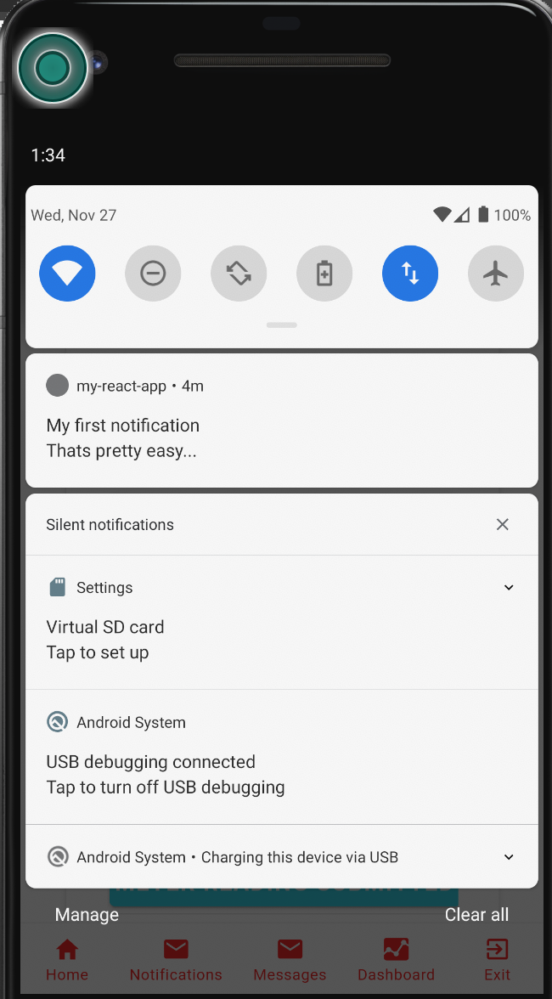

# Local Notifications

See [cordova-plugin-local-notifications](https://github.com/katzer/cordova-plugin-local-notifications) for the full documentation of options.

Client app code

```ts
import { LocalNotifications } from "@ionic-native/local-notifications";

export const addLocalNotification = (opts: any = {}) => {
  console.log("addLocalNotification", opts.text);
  const defaultOpts = {
    title: "Transfer event",
    text: "A new transfer event",
    foreground: true
  }
  LocalNotifications.schedule(
    ...defaultOpts,
    ...opts
  });
};
```

You can add buttons, inputs, attachments and much more...

### Launch details

See [plugin launch-details](https://github.com/katzer/cordova-plugin-local-notifications#launch-details)

Check the `launchDetails` to find out if the app was launched by clicking on a notification.

```js
document.addEventListener(
  "deviceready",
  function() {
    console.log(cordova.plugins.notification.local.launchDetails);
  },
  false
);
```

```ts
import { LocalNotifications } from "@ionic-native/local-notifications";

export const App = (props: any = {}) => {
  const goToRoute = (route) => props.history.push(`/${route}`);

  const isForTransferEvent = (details) => {
    // ... use f.ex id to determine
    return details.type === 'transfer-event'
  }

  const onDeviceReady = () => {
    const { launchDetails } = LocalNotifications
    if (isForTransferEvent(launchDetails)) {
      const route = 'events'
      props.history.push(`/${route}`);
    }
    // if launched from notification, push specific route to go to that page in the app
  }
```

See [issue: launchDetails for Ionic app](https://github.com/katzer/cordova-plugin-local-notifications/issues/1856) for more on how to handle and achieve this

I guess I could use

```ts
/**
   * Sets a callback for a specific event
   * @param eventName {string} The name of the event. Available events: schedule, trigger, click, update, clear, clearall, cancel, cancelall. Custom event names are possible for actions
   * @return {Observable}
   */
  on(eventName: string): Observable<any>;
  /**
   * Not an official interface, however its possible to manually fire events.
   * @param eventName The name of the event. Available events: schedule, trigger, click, update, clear, clearall, cancel, cancelall. Custom event names are possible for actions
   * @param args Optional arguments
   */
  fireEvent(eventName: string, args: any): void;
  /**
   * Fire queued events once the device is ready and all listeners are registered.
   * @returns {Promise<any>}
   */
```

```ts
plugin.fireEvent("trigger-event", launchDetails);
```

I'm using React but I can see this is just an RxJS observable (default used in Angular). Luckily the Observable has a `toPromise` method to make it easier to work with

```ts
cons eventPromise = plugin.on('trigger-event').toPromise()
eventPromise.then((details) => console.log(details))
```

Sample launch/trigger logic

```js
const details = LocalNotification.launchDetails;

if (details) {
  alert("Launched by notification with ID " + details.id);
}

plugin.on("trigger", function(toast, e) {
  console.log(toast);
});
plugin.on("click", function(toast, e) {
  console.log(toast);
});

const launchDetails = {
  id: 1,
  text: "A sample toast",
  sound: true,
  trigger: { in: 5, unit: "second" },
  foreground: true,   //this seems to be needed on iOS
  actions: [ { id: 'actionclick', launch: true, title: 'Click me' } ]
  type: "transfer-event" // custom launch detail?
};

plugin.schedule(launchDetails);
```

For default values see `cordova.plugins.notification.local.getDefaults();`

To change some default values:

```ts
LocalNotifications.setDefaults({
  led: { color: "#FF00FF", on: 500, off: 500 },
  vibrate: false
});
```

In frameworks like Ionic the plugin will fires the event on app start before the app is able to listen for the events. To handle this case, it is possible to fire the queued events manually by defining a global variable.

`window.skipLocalNotificationReady = true`

Once the app and Ionic is ready, you can fire the queued events manually.

```js
cordova.plugins.notification.local.fireQueuedEvents();
```

### Trigger event and resulting notification

Click on the `events` tab of the app to make the app subscribe to transfer event notifications.
Go to the `dashboard` tab and trigger an event.

### Android Simulator

Drag down the top bar of the android simulator (where battery indicator is situated) to display notifications



You should see your notification displayed

## LocalNotifications interface

```ts
export declare class LocalNotificationsOriginal extends IonicNativePlugin {
  /**
   * Informs if the app has the permission to show notifications.
   * @returns {Promise<boolean>}
   */
  hasPermission(): Promise<boolean>;
  /**
   * Request permission to show notifications if not already granted.
   * @returns {Promise<boolean>}
   */
  requestPermission(): Promise<boolean>;
  /**
   * Schedules a single or multiple notifications
   * @param options {Notification | ILocalNotification[]} optional
   */
  schedule(options?: ILocalNotification | ILocalNotification[]): void;
  /**
   * Updates a previously scheduled notification. Must include the id in the options parameter.
   * @param options {ILocalNotification} optional
   */
  update(options?: ILocalNotification): void;
  /**
   * Clears single or multiple notifications
   * @param notificationId {any} A single notification id, or an array of notification ids.
   * @returns {Promise<any>} Returns a promise when the notification had been cleared
   */
  clear(notificationId: any): Promise<any>;
  /**
   * Clears all notifications
   * @returns {Promise<any>} Returns a promise when all notifications have cleared
   */
  clearAll(): Promise<any>;
  /**
   * Cancels single or multiple notifications
   * @param notificationId {any} A single notification id, or an array of notification ids.
   * @returns {Promise<any>} Returns a promise when the notification is canceled
   */
  cancel(notificationId: any): Promise<any>;
  /**
   * Cancels all notifications
   * @returns {Promise<any>} Returns a promise when all notifications are canceled
   */
  cancelAll(): Promise<any>;
  /**
   * Checks presence of a notification
   * @param notificationId {number}
   * @returns {Promise<boolean>}
   */
  isPresent(notificationId: number): Promise<boolean>;
  /**
   * Checks is a notification is scheduled
   * @param notificationId {number}
   * @returns {Promise<boolean>}
   */
  isScheduled(notificationId: number): Promise<boolean>;
  /**
   * Checks if a notification is triggered
   * @param notificationId {number}
   * @returns {Promise<boolean>}
   */
  isTriggered(notificationId: number): Promise<boolean>;
  /**
   * Check if a notification has a given type.
   * @param {number} id The ID of the notification.
   * @param {string} type  The type of the notification.
   * @returns {Promise<boolean>}
   */
  hasType(id: number, type: string): Promise<boolean>;
  /**
   * Get the type (triggered, scheduled) for the notification.
   * @param {number} id The ID of the notification.
   */
  getType(id: number): Promise<boolean>;
  /**
   * Get all the notification ids
   * @returns {Promise<Array<number>>}
   */
  getIds(): Promise<number[]>;
  /**
   * Get the ids of scheduled notifications
   * @returns {Promise<number[]>} Returns a promise
   */
  getScheduledIds(): Promise<number[]>;
  /**
   * Get the ids of triggered notifications
   * @returns {Promise<Array<number>>}
   */
  getTriggeredIds(): Promise<number[]>;
  /**
   * Get a notification object
   * @param notificationId {any} The id of the notification to get
   * @returns {Promise<ILocalNotification>}
   */
  get(notificationId: any): Promise<ILocalNotification>;
  /**
   * Get all notification objects
   * @returns {Promise<ILocalNotification[]>}
   */
  getAll(): Promise<ILocalNotification[]>;
  /**
   * Get a scheduled notification object
   * @param notificationId {any} The id of the notification to get
   * @returns {Promise<ILocalNotification>}
   */
  getScheduled(notificationId: any): Promise<ILocalNotification>;
  /**
   * Get a triggered notification object
   * @param notificationId The id of the notification to get
   * @returns {Promise<ILocalNotification>}
   */
  getTriggered(notificationId: any): Promise<ILocalNotification>;
  /**
   * Adds a group of actions
   * @param groupId The id of the action group
   * @param actions The actions of this group
   * @returns {Promise<any>}
   */
  addActions(groupId: any, actions: ILocalNotificationAction[]): Promise<any>;
  /**
   * Removes a group of actions
   * @param groupId The id of the action group
   * @returns {Promise<any>}
   */
  removeActions(groupId: any): Promise<any>;
  /**
   * Checks if a group of actions is defined
   * @param groupId The id of the action group
   * @returns {Promise<boolean>} Whether the group is defined
   */
  hasActions(groupId: any): Promise<boolean>;
  /**
   * Gets the (platform specific) default settings.
   * @returns {Promise<any>} An object with all default settings
   */
  getDefaults(): Promise<any>;
  /**
   * Overwrites the (platform specific) default settings.
   * @returns {Promise<any>}
   */
  setDefaults(defaults: any): Promise<any>;
  /**
   * Get all scheduled notification objects
   * @returns {Promise<Array<ILocalNotification>>}
   */
  getAllScheduled(): Promise<ILocalNotification[]>;
  /**
   * Get all triggered notification objects
   * @returns {Promise<Array<ILocalNotification>>}
   */
  getAllTriggered(): Promise<ILocalNotification[]>;
  /**
   * Sets a callback for a specific event
   * @param eventName {string} The name of the event. Available events: schedule, trigger, click, update, clear, clearall, cancel, cancelall. Custom event names are possible for actions
   * @return {Observable}
   */
  on(eventName: string): Observable<any>;
  /**
   * Not an official interface, however its possible to manually fire events.
   * @param eventName The name of the event. Available events: schedule, trigger, click, update, clear, clearall, cancel, cancelall. Custom event names are possible for actions
   * @param args Optional arguments
   */
  fireEvent(eventName: string, args: any): void;
  /**
   * Fire queued events once the device is ready and all listeners are registered.
   * @returns {Promise<any>}
   */
  fireQueuedEvents(): Promise<any>;
}
```
