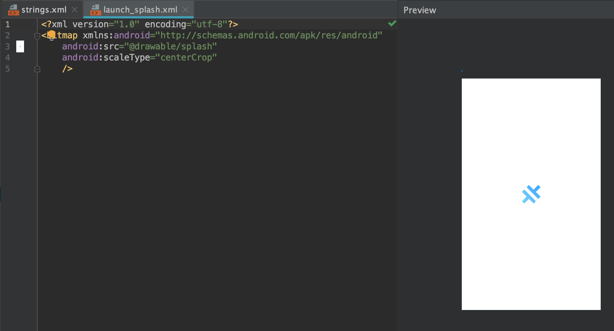

# Android styling

The following guide assumes you have the Ionioc android project opened in Android Studio and that the project is configured and can build without errors.

## Edit Android App styling

Under the `app/res/values` for your `android` app, find and open the `styles.xml` file

Edit the styles file to suit your styling preferences

In most cases you will primarily edit the `android:background` to add or remove a splash screen or background image. Notice that it is pre-configured with a color theme that can be further customized as needed.

## Edit Android App name

Under the `app/res/values` for your `android` app, find and open the `string.xml` file

Edit the `app_name` and `title_activity_main` entries with the name of your app.

## Edit Android App icon

Right click the `res` folder and select `new -> Image asset`

Configure the image asset

Confirm the image asset path

Click finish and override any existing assets.

## Edit Splash screen

Find and open the `res/drawable` foldr

Edit the `launch_splash.xml` file to make `android:src` point to the splash media folder of your preference (here the `drawable/splash` folder under `res`).

The preview will display how the splash screen will look on the simulator or real device.
