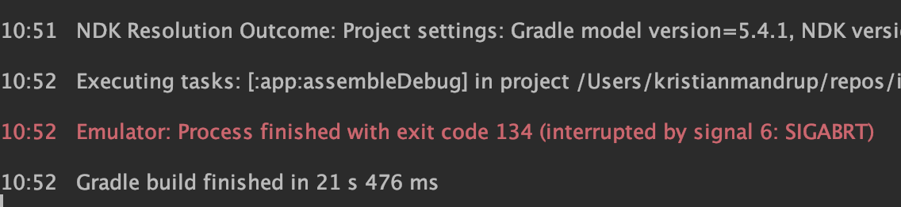
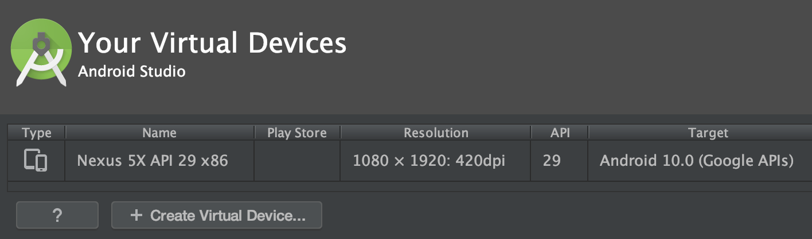
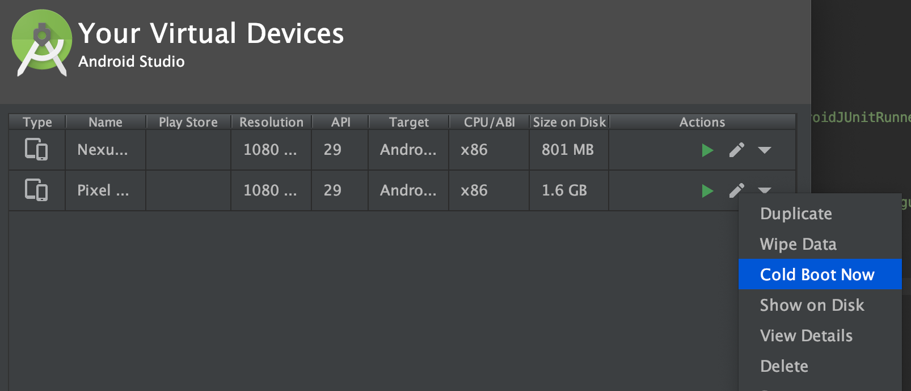

# Android Studio troubleshooting

In case it displays errors like:

```sh
Unsupported Modules Detected: Compilation is not supported for following modules: capacitor-cordova-android-plugins. Unfortunately you can't have non-Gradle Java modules and Android-Gradle modules in one project.
```

See [Capacitor issue](https://github.com/ionic-team/capacitor/issues/349)

From Android Studio, reset, restart and rebuild

- `File -> Invalidate Caches/restart`
- `File -> Sync Project with gradle files`

If Android Studio alerts you of updates available, run the update. Then reload Android Studio and run the app again. Erros may be due to "out of sync" configurations/dependencies that will (in most cases) be re-synced when the update is completed.

## Emulator exit code error

In case you get an Emulator exit code 134 error when you run the emnulator



Open the AVD (Android Virtual Devices) Manager



Select `Cold boot` from the drop-down for the device



Run the emulator again
