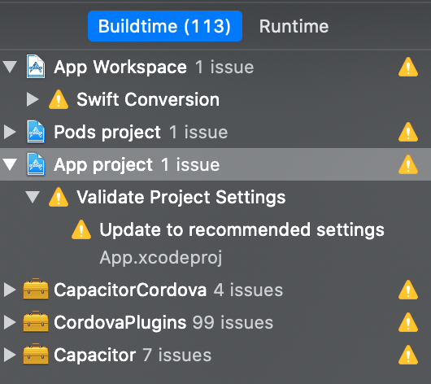
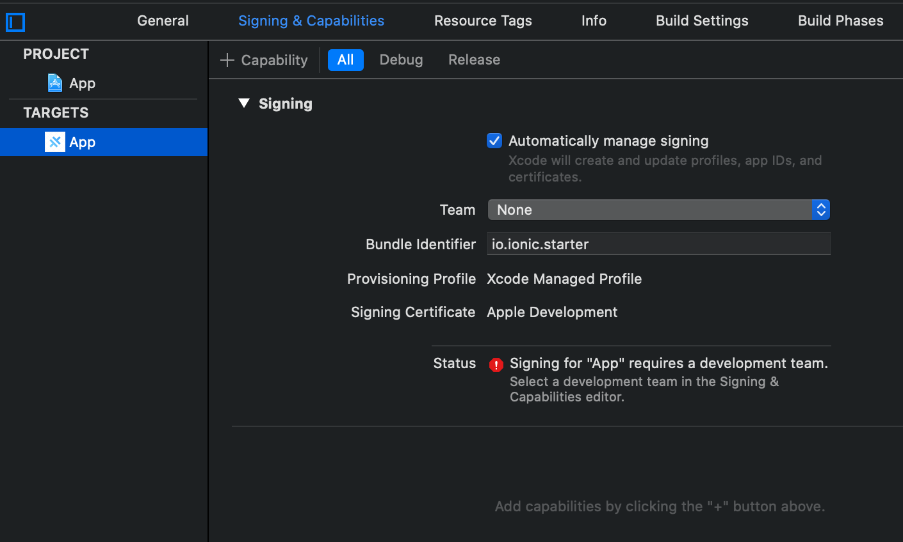
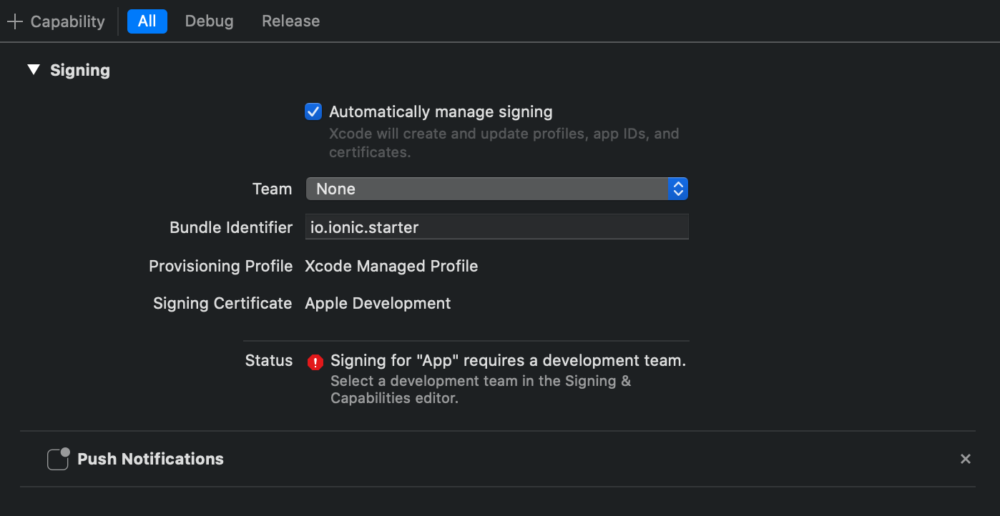

# iOS Push Notifications

See [Capacistor Push Notifications](https://capacitor.ionicframework.com/docs/apis/push-notifications/)

On iOS you must enable `Push Notifications Capabilities` in your project to enable the `Push Notifications` plugin to work.

In XCode, select the `App` in the project tree (to the left)



Select the `Signin & Capabilities` tab



- Click the `+ Capability` button (to the left of the `All` tab at the top)
- Select the `Push notifications` capability


Make sure push notifications have been added



This change should add an entitlements file to the ios app in `ios/App/App/App.entitlements`

```xml
<?xml version="1.0" encoding="UTF-8"?>
<!DOCTYPE plist PUBLIC "-//Apple//DTD PLIST 1.0//EN" "http://www.apple.com/DTDs/PropertyList-1.0.dtd">
<plist version="1.0">
<dict>
  <key>aps-environment</key>
  <string>development</string>
</dict>
</plist>
```

## Push notifications appearance in foreground

On iOS you can configure the way the push notifications are displayed when the app is in foreground by providing the presentationOptions in your capacitor.config.json as an Array of Strings you can combine.

Possible values are:

- `badge`: badge count on the app icon is updated (default value)
- `sound`: the device will ring/vibrate when the push notification is received
- `alert`: the push notification is displayed in a native dialog
  An empty Array can be provided if none of the previous options are desired. `pushNotificationReceived` event will still be fired with the push notification information.

```json
"plugins": {
  "PushNotifications": {
    "presentationOptions": ["badge", "sound", "alert"]
  }
}
```

## Add firebase support to iOS app (for FCM)

See [Set up a Firebase Cloud Messaging client app on iOS](https://firebase.google.com/docs/cloud-messaging/ios/client)

First [Register app with Firebase](https://firebase.google.com/docs/cloud-messaging/ios/client#register-app)

Then [Add firebase configuration file](https://firebase.google.com/docs/cloud-messaging/ios/client#add-config-file) to your project

This is a `GoogleService-Info.plist` file

[Upload APNs with Firebase](https://firebase.google.com/docs/cloud-messaging/ios/certs)

The Firebase Cloud Messaging APNs interface uses the [Apple Push Notification service](https://developer.apple.com/notifications/) (APNs) to send messages up to 4KB in size to your iOS app, including when it is in the background.

To enable sending Push Notifications through APNs, you need:

- An Apple Push Notification Authentication Key for your Apple Developer account. Firebase Cloud Messaging uses this token to send Push Notifications to the application identified by the App ID.
- A provisioning profile for that App ID.

You create both in the [Apple Developer Member Center](https://idmsa.apple.com/IDMSWebAuth/signin).
