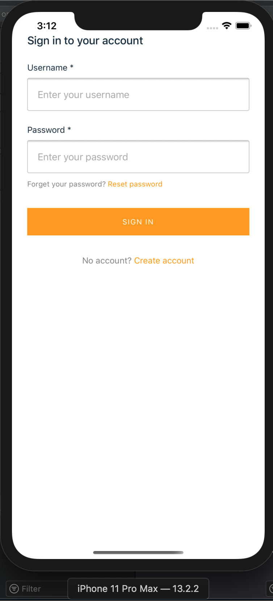

# iOS

- [Ionic iOS installation docs](https://ionicframework.com/docs/installation/ios)
- [iOS environment setup and development workflow](https://github.com/TransformCore/eon-ionic-enduser-client-app/blob/master/docs/iOS.md)

## Prepare app for iOS

Run `npm run ios:prepare`

This will

- build the project `npm run build`
- add ios project `ionic capacitor add ios`
- copy web assets to ios project `ionic capacitor copy ios`
- open ios `ionic capacitor open ios`

You should then be able to run the Ionic app on the simulator.

## Sync app to iOS

Run `npm run ios:sync`

## Run from XCode

Choose a device and select `run`

### Login

Enter credentials. If no account, create a new account, then login.

### Home

### Events list

Displays events received

### Dashboard

Displays dashboard where you can trigger events

